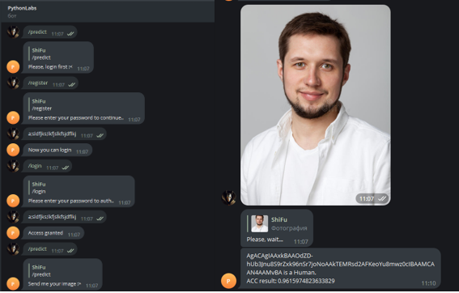

<center> <h1>Лабораторная работа №4</h1> </center>
<center> <h2>Реализация Telegram-бота на языке программирования Python</h2> </center>
<p align="right"> Выполнил: Галкин Климентий. 4851003/10002 </p>

<center><h2>Цель работы</h2></center>

**Цель работы** - получение навыков создания Telegram-ботов на языке программирования Python.
Задание на работу
*	Установить модуль telebot для работы с Telegram-ботом 
*	Изучить функционал модуля telebot.
*	Получить токен для работы с ботом путем обращения к боту 
*	Реализовать собственный Telegram-бот, который поддерживает команды: ``register``, ``login``, ``start``, ``predict``, ``logout``.

<center><h2>Ход работы</h2></center>

В ходе лабораторной работы был создан бот, для работы с которым был сгенерирован токен. Токен нужен, чтобы начать использовать официальную API от Telegram. Внутри модуля telebot написаны методы для работы с конечными точками API. Основные методы, которые дальше будут использоваться: ``reply_to``, ``send_message``, декоратор ``message_handler``, ``register_next_step_handler``, ``get_file``, ``download_file``.

Для начала уточнение, что основные константы, в том числе и объект бота, лежат в отдельном файле botconfig.py, который разработчик может настраивать под свои нужны. Более того, токен бота берется из переменной окружения, поэтому перед началом работы нужно выполнить команду:

```powershell
$Env:BOT_TOKEN=”токен бота”
```
Каждая команда бота, которая требуется по заданию, проверяется на использование через декоратор ``message_handler``, который принимает параметр ``commands`` – список команд, при использовании которых должна вызываться декорируемая функция.
Так же, поскольку бот должен иметь возможность регистрации и входа пользователя для использования функционала классификации картинки, было принято решение просто писать в файл JSON-объект типа:
 ```json
 1928371318:["sha256(password + salt)", 0]
 ```
 
Такая запись быстро позволяет проверять, что пользователь уже зарегистрирован, и не перетирать пароль на новый. Функции входа в бота изменяют поле статуса в "базе" у пользователя, который пытается войти. Выход соответственно ставит этот статус в значение 0
Еще один важный пункт заключался в том, чтобы превратить скрипт с моделью в обособленный модуль – класс, который принимает в себя один параметр – название картинки. Для этого из кода были убраны аргументы командной строки, а пути до датасетов стали константами. Исходный код модуля выглядит следующим образом:

```py
import argparse as ap
import numpy as np
import tensorflow as tf
import matplotlib.pyplot as plt
from typing import Any
from keras.preprocessing.image import ImageDataGenerator, DirectoryIterator
from keras.utils import load_img, img_to_array


class ModelTrain:
    def __init__(self, image_path: str) -> None:
        self.IMAGE_PATH = image_path
        self.TRAIN_DIR = "./data/train"
        self.VALID_DIR = "./data/valid"

    def _create_generator(self) -> tuple[DirectoryIterator]:
        train_datagen = ImageDataGenerator(rescale=1/255)
        validation_datagen = ImageDataGenerator(rescale=1/255)

        train_generator = train_datagen.flow_from_directory(
            self.TRAIN_DIR,
            classes=['human', 'shark'],
            target_size=(200, 200),
            batch_size=190,
            class_mode='binary')

        validation_generator = validation_datagen.flow_from_directory(
            self.VALID_DIR,
            classes=['human', 'shark'],
            target_size=(200, 200),
            batch_size=15,
            class_mode='binary',
            shuffle=False)

        return (train_generator, validation_generator)

    def _model_compile(self) -> tuple[tf.keras.models.Sequential, Any]:
        (train_generator, validation_generator) = self._create_generator()
        model = tf.keras.models.Sequential([
            tf.keras.layers.Flatten(input_shape=(200, 200, 3)),
            tf.keras.layers.Dense(128, activation=tf.nn.relu),
            tf.keras.layers.Dense(1, activation=tf.nn.sigmoid)
        ])

        model.summary()
        model.compile(optimizer=tf.keras.optimizers.Adam(),
                      loss='binary_crossentropy',
                      metrics=['accuracy'])

        history = model.fit(train_generator,
                            steps_per_epoch=15,
                            epochs=15,
                            verbose=1,
                            validation_data=validation_generator,
                            validation_steps=15)
        return (model, history)

    def predict_image(self) -> str:
        (model, history) = self._model_compile()
        img = load_img(self.IMAGE_PATH, target_size=(200, 200))
        x = img_to_array(img)
        plt.imshow(x / 255.)
        x = np.expand_dims(x, axis=0)
        images = np.vstack([x])
        classes = model.predict(images, batch_size=19)
        return_value = "There"
        return_value += " is a **Human**" if classes[0] < 0.5 else " is a **Shark**"
        return_value += " in your image. "
        acc_res = history.history['accuracy']
        return_value += f"\nACC result: **{sum(acc_res) / len(acc_res)}**"
        tf.keras.backend.clear_session()
        return return_value
```
 
Теперь, при использовании команды ``predict`` происходит три момента:
1.	Идет проверка на то, что пользователь вошел в бота через ``check_session``
2.	Происходит скачивание картинки на сервер
3.	Имя картинки передается в объект класса ``ModelTrain``. Вызывается ``predict_image``, который возвращает результат классификации.

Пример работы бота представлен на рисунках ниже:


  
<center><h2>Вывод</h2></center>

В ходе лабораторной работы были изучены принципы разработки Тегерам-ботов с использованием модуля telebot, разработан Телеграм-бот, в котором реализован механизм регистрации и входа пользователя. По результатам аутентификации пользователь может использовать функционал по классификации отправленной картинки.

<center><h2>Ответы на вопросы<h2></center>

1.	**Что такое аутентификация?**

    Аутентификация — процедура проверки подлинности, например проверка подлинности пользователя путем сравнения введенного им пароля с паролем, сохраненным в базе данных

2.	**Что такое авторизация?**

    Авторизация — предоставление определенному лицу или группе лиц прав на выполнение определенных действий.

3.	**Чем аутентификация отличается от авторизации?**

    Авторизация и аутентификация — два разных процесса. Аутентификация нужна, чтобы проверить право доступа к данным, авторизация — это когда идет получение доступа.

4.	**Для чего нужен токен Telegram-бота?**

    Для доступа к официальной API от Telegram.

Приложение

```py
import hashlib
import json
from botconfig import *
from classification import ModelTrain


USERS_DB = dict()


def check_session(message) -> bool:
    try:
        return USERS_DB[message.from_user.id][1]
    except KeyError:
        return False


def check_passwd(message) -> None:
    user_input = message.text
    chat_id = message.chat.id
    user_id = message.from_user.id
    try:
        if USERS_DB[user_id][0] == hashlib.sha256(user_input.encode() + SALT.encode()).hexdigest():
            USERS_DB[user_id][1] = 1
            BOT.send_message(chat_id, "Access granted")
        else:
            BOT.send_message(chat_id, "Access denied. Check your password")
    except BaseException:
        BOT.send_message(chat_id, "Something went wrong")


@BOT.message_handler(commands=['start', 'help'])
def send_usage(message) -> None:
    BOT.reply_to(message, text=INFO_MESSAGE)


@BOT.message_handler(commands=["register"])
def register_user(message) -> None:
    BOT.reply_to(message, REGISTER_MESSAGE)
    BOT.register_next_step_handler(message, init_new_user)


@BOT.message_handler(commands=["login"])
def login_user(message) -> None:
    BOT.reply_to(message, LOGIN_MESSAGE)
    BOT.register_next_step_handler(message, check_passwd)


@BOT.message_handler(commands=['predict'])
def image_processing(message) -> None:
    if check_session(message):
        BOT.reply_to(message, "Send me your image :>")
        BOT.register_next_step_handler(message, predict_init)
    else:
        BOT.reply_to(message, "Please, login first :<")


@BOT.message_handler(commands=['logout'])
def logout(message) -> None:
    BOT.reply_to("Okey, have a nice day!")
    try:
        USERS_DB[message.from_user.id][1] = 0
        BOT.send_message(message.chat.id, "Logout successful..")
    except KeyError:
        BOT.send_message(message.chat.id, "Wait.. You're not out user :<")


def predict_init(message) -> None:
    BOT.reply_to(message, "Please, wait...")
    fileId = message.photo[-1].file_id
    file_info = BOT.get_file(fileId)
    download_object = BOT.download_file(file_info.file_path)
    with open(f"./tmp/{file_info.file_id}", "wb") as user_image:
        user_image.write(download_object)
    new_model_object = ModelTrain(image_path=f"./tmp/{file_info.file_id}")
    predict_result = new_model_object.predict_image()
    BOT.send_message(message.chat.id, predict_result, parse_mode="Markdown")
    os.remove(f"./tmp/{file_info.file_id}")


def init_new_user(message) -> None:
    user_passwd = message.text
    chat_id = message.chat.id
    user_id = message.from_user.id
    try:
        if USERS_DB[user_id]:
            BOT.send_message(chat_id, "You are already have an account")
    except KeyError:
        USERS_DB.update(
            {user_id: [hashlib.sha256(user_passwd.encode() + SALT.encode()).hexdigest(), 0]})
        with open(f"{BOT_FOLDER}/user_db", "w") as f:
            f.write(json.dumps(USERS_DB))
        BOT.send_message(chat_id, "Now you can login")


def read_db() -> dict:
    database = {}
    if os.path.exists(f"{BOT_FOLDER}/user_db"):
        with open(f"{BOT_FOLDER}/user_db", 'r') as db:
            database = json.load(db)
    return database


def main() -> None:
    USERS_DB = read_db()
    print("Telegram Support Bot started...")
    BOT.polling()


if __name__ == "__main__":
    main()
```