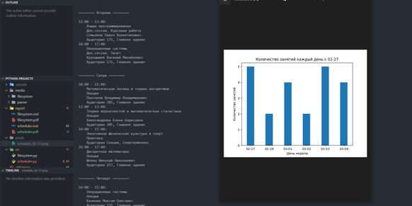
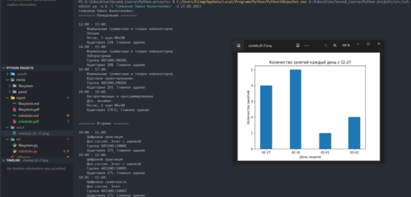

<center> <h1>Лабораторная работа №2</h1> </center>
<p align="right"> Выполнил: Галкин Климентий. 4851003/10002 </p>

<center> <h2> Цели и задачи </h2> </center>
Цель работы - Получение навыков работы с протоколом HTTP: построение запросов к удаленному веб-серверу для получения содержимого веб-страницы. Получение навыков обработки и извлечения данных из HTMLстраницы при помощи Python-библиотек

<center> <h2> Ход работы </h2> </center>

Изначально идея работы заключается в том, что скрипт берет расписание занятий, парсит полученный HTML-код по заданным параметрам. Но рассмотрим GET-запросы на расписание: есть переменная в локальном контексте JS: ``window.__INITIATL__STATE__ = {}``, который хранит в себе ответ в виде JSON. Отлично, значит задачу можно свести к парсингу JSON-ответа

В ходе лабораторной работы было создано три класса, один из которых является классом специальной ошибки **SchedulerFindError**
Два других являются основными классами: **RequestSender** и **ParseSchedule**. Важно отметить, что класс парсинга расписания наследуется от класса запросов. Поэтому мменяетс логика функции ``__init__`` - добавляется метод ``super()`` на инит родительского класса.


<center> <h3> Описание программы </h3> </center>

Рассмотрим каждый класс подробнее:

* **RequestSender**
  * ``date_format`` - функция преобразования даты из аргументов командной строки согласно виду даты для запроса. Дата в запросе выглядит следующим образом: **YYYY-M-DD**
  * ``find_group`` - функция нахождения ID группы и ее факультета. Проблема работы расписания в том, что для каждой группы, аудитории, преподавателя, здания, типа предмета и т.д, поэтому для формирования расписания нужно сначала узнать идентификаторы. Так что функция возвращает кортеж из двух значений.
  * ``find_teacher`` - метод ннаходи ID преподавателя по ФИО. Особенность функции, что достается ID первого найденного преподавателя.
  * ``extract_initial_state`` - вытаскивает JSON из ответа.
  * ``get_teacher_schedule`` - получает из ответа ТОЛЬКО расписание занятий.
  * ``get_group_schedule`` - пполучаети ответа ТОЛЬКО расписание занятий группы по дням.

* **ParseSchedule**
  * ``print_schedule`` - вывод форматированного расписания. Берет только необходимую информацию из расписания
    * Время
    * Название предмета
    * Группы/Поток, курс (для преподавателя)
    * Аудитория, здание
    * ФИО преподавателя (для группы)
  * ``draw_graph`` - использует внутри себя функцию ***print_schedule*** для возвращения статистики по количеству занятий на каждый день выбранной недели. В результате после модификации даты (убирается YYYY-, потому что нет смысла отображать текущий год), собирается фигура библиотеки ``matplotlib`` и полученный график сохраняется в директорию ***result***

Функция ``main()`` просто парсит аргументы, создает объект класса **ParseSchedule** с значениями аргументов, которые нужны для наследования **RequestSender**

<center> <h2> Результаты работы </h2> </center>

* Результат вывода расписания группы 4851003/10002
  * 

* Результат вывода расписания преподавателя Семьянова Павла Валентиновича
  * 

<center> <h2> Вывод </h2> </center>

В ходе лабораторной работы был изучен принцип работы с запросами на сайт, обработкой информации из ответов сервиса. Был реализован скрипт на языке Python, позволяющий получать расписание преподавателя по ФИО или группы по номеру академичекой группы.

<center> <h2> Ответы на контрольные вопросы </h2> </center>

1.	**Какие виды HTTP-запросов существуют, для чего нужен каждый из них? Какие данные можно получить при отправке GET-запроса к web-ресурсу?** 

Описывается 9 возможных HTTP-методов при отправке запросов
  * GET – Служит для получения данных с сервера. Данные могут быть разные: от наполнения страницы, включая HTML, CSS, JS и т. д., до статистических данных
  * POST – метод для отправки данных (сущностей) на сервер.
  * HEAD – работает как GET но не получает тело ответа, в основном используется для проверки существования ресурса.
  * PUT/DELETE – добавляет/удаляет данные на ресурс. Считается необходимым запрещать отправлять запросы с такими методами без верификации источника запроса, что логично.
  * CONNECT – создает “туннель” до сервера, на котором работает ресурс.
  * OPTIONS – метод для настройки “сложных запросов”, то есть таких, где используются особые заголовки. Служит для обработки “кастомных” запросов.
  * TRACE – извлекает тестовое сообщение с ресурса
  * PATCH – производит частичное изменение ресурса

2.	**Что такое DOM-объект, для чего он необходим? Какие библиотеки и функции были использованы при анализе HTML-страницы?**

DOM – объектная модель HTML-документа. Иначе говоря, это дерево тегов HTML-документа. Для парсинга DOM-объекта в моей реализации не использовались никакие библиотеки. Использовалась библиотека регулярных выражений, которая искала переменную \_\_INITIAL\_STATE\_\_ и брала оттуда значения. Это обычный поиск по тексту. Если думать решение задания через DOM-объект, тогда стоит задуматься об использовании ``beautifulsoup``.

3.	**По умолчанию в библиотеке requests включена проверка SSL- сертификатов. Что необходимо сделать, чтобы запросы к защищенным страницам работали корректно?** 

Модуль при отправке запросов проверяет SSL-сертификаты, как браузер. Однако, если сертификата на самом деле нет, то будет ошибка класса SSLError. Чтобы избежать ошибок, можно через параметр verify метода запрос( например, requests.get() ) указать путь до одиночного сертификата, до директории с сертификатами или указать False, чтобы не использовать сертификат. Тогда запросы будут обрабатываться корректно.

4.	**Из каких частей состоит HTTP-запрос? Какие способы передачи параметров в запрос существуют?**

Любой запрос можно разделить на три части: строка запроса, заголовки (хедеры), тело запроса. В строке запроса указывается метод запроса (GET, POST…), конечная точка запроса и версия HTTP. В заголовках содержится необходимая для сервера информация о запросе: источник запроса, тип аутентификации, тип отправляемых в теле данных, длина тела запроса и т. д. После идет пустая строка, указывающая, что все данные отправленные. Потом идут уже сами данные в запросе – тело запроса.

5.	**Что такое API в контексте веб-серверов?**

API – интерфейс взаимодействия с сервером. Иначе говоря, это набор методов ( функции ), в которых определены обязательные входные данные, тип этих данных, и выходные данные и их формат.


<center> <h2> Приложение </h2> </center>

```py
import os
import re
import json
import requests as req
import argparse as arg
import matplotlib.pyplot as plt
from urllib.parse import quote


class ScheduleFindError(Exception):
    '''
    Default own Exception
    '''

    def __init__(self, *args: object) -> None:
        super().__init__(*args)

    def __str__(self) -> str:
        return 'Не удалось найти расписание по параметру. Проверьте введенное значение'


class RequestSender:
    '''
    A class with some functionality that allows you to find data about
    teachers and about the group, as well as to get the
    timetable by parameters in raw form
    '''

    def __init__(self, teacher_name: str, group_id: str, date: str, place: str) -> None:
        self.ENDPOINTS = {
            "group": "https://ruz.spbstu.ru/search/groups?q=",
            "teacher": "https://ruz.spbstu.ru/search/teacher?q=",
            "teacher_schedule": "https://ruz.spbstu.ru/teachers/"
        }
        self.teacher_name = teacher_name
        self.group_id = group_id
        self.date = date
        self.place = place

    def date_format(self) -> str:
        '''
        Formatting the date according to its type in the query
        '''
        try:
            date_raw = self.date.split('.')
            return f"{date_raw[2]}-{date_raw[1]}-{date_raw[0]}"
        except AttributeError:
            return ""

    def find_group(self) -> tuple:
        '''
        Finding the group id for queries and the faculty id.\n
        Important! The id of the faculty is a necessary parameter,\n
        because it participates in the formation of the link in the query
        '''
        response = req.get(
            self.ENDPOINTS['group'] + quote(self.group_id, safe=''))
        data = self.extract_initial_state(response)
        if len(data["searchGroup"]["data"]) == 1:
            return (
                data["searchGroup"]["data"][0]["faculty"]["id"],
                data["searchGroup"]["data"][0]["id"]
            )
        else:
            return (-1, -1)

    def find_teacher(self) -> int:
        '''
        Finding a teacher's id by FULL NAME (last name, first name, patronymic)
        '''
        resp = req.get(self.ENDPOINTS['teacher'] +
                       quote(self.teacher_name, safe=''))
        data = self.extract_initial_state(resp)
        if len(data['searchTeacher']['data']) == 1:
            return data['searchTeacher']['data'][0]['id']
        else:
            return -1

    def find_place(self) -> tuple:
        '''
        Optional task. Use ``api/v1/ruz/buildings`` for json
        '''
        pass

    def extract_initial_state(self, data: req.Response) -> dict:
        '''
        Extract all data from HTML response
        '''
        return json.loads(re.findall(r"\{\"faculties\".+", data.text)[0][:-2])

    def get_teacher_schedule(self) -> dict:
        '''
        Get a raw teacher's schedule by his own id
        '''
        teacher_id = self.find_teacher()
        if teacher_id == -1:
            raise ScheduleFindError
        resp = req.get(self.ENDPOINTS['teacher_schedule'] +
                       str(teacher_id) + "?date=" + self.date_format())
        data = self.extract_initial_state(resp)
        return data['teacherSchedule']['data'][str(teacher_id)]

    def get_group_schedule(self) -> dict:
        '''
        Get a raw group's schedule by his own id
        '''
        g_info = self.find_group()
        if g_info[1] == -1:
            raise ScheduleFindError
        resp = req.get(
            f"https://ruz.spbstu.ru/faculty/{g_info[0]}/groups/{g_info[1]}?date={self.date_format()}")
        data = self.extract_initial_state(resp)
        return data['lessons']['data'][str(g_info[1])]


class ParseSchedule(RequestSender):
    '''
    Standard class with custom schedule output,\n
    where there is the minimum necessary information
    '''

    def __init__(self, args: arg.Namespace) -> None:
        super().__init__(teacher_name=args.t,
                         group_id=args.g,
                         date=args.d,
                         place=args.a)
        self.WEEKDAYS = {
            1: "Понедельник",
            2: "Вторник",
            3: "Среда",
            4: "Четверг",
            5: "Пятница",
            6: "Суббота",
            7: "Воскресенье"
        }
        self.mode = 'teacher' if args.m == 1 else 'group'

    def print_schedule(self) -> dict:
        '''
        Beautiful output of the schedule
        according to the selected mode of the script
        '''
        graph_info = dict()
        match self.mode:
            case 'teacher':
                print(self.teacher_name)
                raw_schedule = self.get_teacher_schedule()
                for day in raw_schedule:
                    print(
                        f"======== {self.WEEKDAYS[day['weekday']]} ========\n")
                    for lesson in day['lessons']:
                        try:
                            graph_info[day['date']] += 1
                        except KeyError:
                            graph_info[day['date']] = 1
                        print(
                            f"{lesson['time_start']} - {lesson['time_end']}:")
                        print(f"    {lesson['subject']}")
                        print(f"    {lesson['typeObj']['name']}")
                        if lesson['additional_info'] == "Поток":
                            print(
                                f"    Поток, {lesson['groups'][0]['level']} курс {lesson['groups'][0]['faculty']['abbr']}")
                        else:
                            print(f"    Группа {lesson['groups'][0]['name']}")
                        print(
                            f"    Аудитория {lesson['auditories'][0]['name']}, {lesson['auditories'][0]['building']['name']}")
                    print("\n")
            case 'group':
                print(self.group_id)
                raw_schedule = self.get_group_schedule()
                for day in raw_schedule:
                    print(
                        f"======== {self.WEEKDAYS[day['weekday']]} ========\n")
                    for lesson in day['lessons']:
                        try:
                            graph_info[day['date']] += 1
                        except KeyError:
                            graph_info[day['date']] = 1
                        print(
                            f"{lesson['time_start']} - {lesson['time_end']}:")
                        print(f"    {lesson['subject']}")
                        print(f"    {lesson['typeObj']['name']}")
                        if (lesson['teachers']):
                            print(f"    {lesson['teachers'][0]['full_name']}")
                        print(
                            f"    Аудитория {lesson['auditories'][0]['name']}, {lesson['auditories'][0]['building']['name']}")
                    print("\n")
        return graph_info

    def draw_graph(self) -> None:
        '''
        Prepare data from raw schedule and draw the bar
        thanks by modified dates and counts
        '''
        data = self.print_schedule()
        count_of_subjects = list(data.values())
        dates = [raw_date[5:] for raw_date in list(data.keys())]
        plt.bar(dates, count_of_subjects, width=0.4)
        plt.title(f"Количество занятий каждый день с {dates[0]}")
        plt.autoscale(enable=True)
        plt.xlabel("День недели")
        plt.ylabel("Количество занятий")
        os.makedirs('result') if not os.path.exists('result') else None
        plt.savefig(f'result/schedule_{dates[0]}.png')


def main():
    parser = arg.ArgumentParser(prog="Polytech Python Schedule",
                                description="A Python script to parse Polytech schedule by teacher name or group id")
    parser.add_argument(
        "-m", type=int, help="Select mode to work: 1 - work with teacher name, 2 - parse by group id", choices=[1, 2], required=True)
    parser.add_argument("-t", type=str, help="Teacher name")
    parser.add_argument("-g", type=str, help="University group ID")
    parser.add_argument("-d", type=str, help="The date you are interested in")
    parser.add_argument("-a", type=str, help="The number of place")

    args = parser.parse_args()
    schedule = ParseSchedule(args=args)
    schedule.draw_graph()


if __name__ == "__main__":
    main()

```
